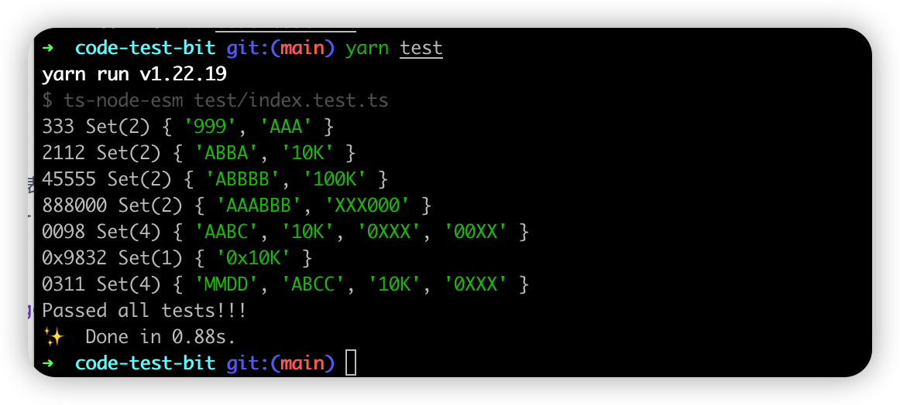

# code-test-bit
> for https://gist.github.com/renzholy/f857b464518e0cf97549a3aee141bd74

## quick-start 
```shell
$ git@github.com:frmachao/code-test-bit.git
$ cd code-test-bit
$ yarn install
$ yarn get:data
$ yarn test
```

